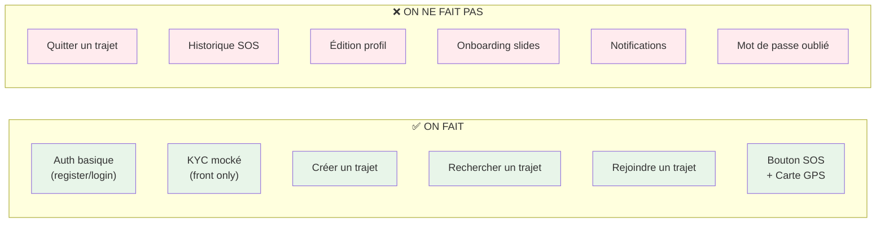

# 🚀 Co-Elles — Sprint MVP Solo · 8 Jours (8–16 Juin)

> **Contrainte** : 1 développeur full-stack solo
> **Philosophie** : Le jury juge ce qu'il **voit**. Backend = minimum vital. Frontend = impeccable.
> **Règle d'or** : Si ça ne se voit pas dans la démo, ça n'existe pas.

---

## Changements vs. Plan Initial (Équipe → Solo)

| Aspect | ❌ Plan Équipe | ✅ Plan Solo |
|--------|---------------|-------------|
| Workflow | Backend + Frontend en parallèle | Séquentiel : Backend d'abord → Frontend ensuite |
| Auth | JWT complet + validation | JWT minimal, 0 validation email |
| KYC | Mock backend (API + délai) | Mock **frontend only** (fake delay + setState) |
| Trajets | CRUD complet + join/leave + pagination | Create + Search basique, join simplifié |
| SOS | API + BDD + historique | API minimale, **focus 100% sur l'UI spectaculaire** |
| Seeder | Script élaboré | 1 script simple, données hardcodées |
| Tests | E2E + appareil physique | 1 run-through manuel la veille |
| Profil | Éditable + emergency contact | Lecture seule, contact hardcodé |

---

## Périmètre Final du MVP Solo



---

## Architecture Simplifiée

```
co-elles/
├── backend/                    # Node.js / Express — MINIMAL
│   ├── server.js               # Point d'entrée unique (tout-en-un)
│   ├── .env
│   ├── config/db.js
│   ├── models/
│   │   ├── User.js
│   │   ├── Trip.js
│   │   └── SOSAlert.js
│   ├── routes/
│   │   ├── auth.js
│   │   ├── trips.js
│   │   └── sos.js
│   ├── middleware/auth.js
│   ├── seed.js                 # Données de démo
│   └── package.json
│
└── frontend/                   # Expo / React Native — PRIORITAIRE
    ├── app/
    │   ├── _layout.js
    │   ├── index.js
    │   ├── (auth)/
    │   │   ├── _layout.js
    │   │   ├── login.js
    │   │   ├── register.js
    │   │   └── kyc.js          # 100% mocké en front
    │   └── (tabs)/
    │       ├── _layout.js
    │       ├── home.js
    │       ├── search.js
    │       ├── create-trip.js
    │       ├── sos.js
    │       └── profile.js
    ├── services/api.js
    ├── context/AuthContext.js
    └── constants/theme.js
```

---

## Endpoints API — Version Minimale

> Seulement **8 routes**. Pas une de plus.

| Méthode | Route | Description | Jour |
|---------|-------|-------------|------|
| `POST` | `/api/auth/register` | Inscription | J1 |
| `POST` | `/api/auth/login` | Login → JWT | J1 |
| `GET` | `/api/auth/me` | Profil connectée | J1 |
| `POST` | `/api/trips` | Créer un trajet | J2 |
| `GET` | `/api/trips` | Rechercher (query: from, to, date) | J2 |
| `GET` | `/api/trips/:id` | Détail trajet | J2 |
| `POST` | `/api/trips/:id/join` | Rejoindre un trajet | J2 |
| `POST` | `/api/sos` | Déclencher alerte SOS | J3 |

---

## 📅 ROADMAP JOUR PAR JOUR — MODE SOLO

---

### 🔵 JOUR 1 — Dimanche 8 Juin (Aujourd'hui, il reste ~5h)
#### « Backend Complet en une soirée »

> [!IMPORTANT]
> Stratégie : on code **TOUT le backend ce soir**. Demain on n'y touche plus.
> Le backend d'un MVP, c'est ~300 lignes de code. En solo, il faut le boucler d'un bloc.

**🤖 Moment IA** — Me demander de générer :
- [ ] Les 3 modèles Mongoose (User, Trip, SOSAlert) — copier-coller direct
- [ ] Le middleware JWT auth — copier-coller direct
- [ ] Les 3 fichiers de routes (auth, trips, sos) avec contrôleurs intégrés
- [ ] Le fichier `server.js` complet
- [ ] Le fichier `seed.js` avec données de démo

**Tâches manuelles** :
- [ ] Créer un compte **MongoDB Atlas** (Free Tier M0)
  - Cluster → Connect → Get connection string
  - Network Access → Allow `0.0.0.0/0`
- [ ] `mkdir backend && cd backend && npm init -y`
- [ ] `npm install express mongoose dotenv cors bcryptjs jsonwebtoken`
- [ ] `npm install -D nodemon`
- [ ] Coller tous les fichiers générés par l'IA
- [ ] Créer `.env` avec `MONGO_URI`, `JWT_SECRET=coelles_secret_2026`, `PORT=5000`
- [ ] `npm run dev` → vérifier que le serveur démarre sans erreur
- [ ] Tester avec **Thunder Client** (extension VS Code) ou `curl` :
  - `POST /api/auth/register` → récupérer le token
  - `POST /api/auth/login` → vérifier le token
  - `GET /api/auth/me` avec le header `Authorization: Bearer <token>`
- [ ] `npm run seed` → vérifier que les données de démo sont en base
- [ ] **Commit** : `feat: complete backend API`

> [!TIP]
> Le backend est **terminé**. On n'y revient que pour fixer un bug bloquant.
> Temps estimé : 2-3h avec l'IA qui génère le code.

---

### 🔵 JOUR 2 — Lundi 9 Juin
#### « Projet Expo + Auth Frontend + Navigation »

> [!NOTE]
> Journée la plus structurante côté front. Si la navigation + auth marchent, tout le reste s'emboîte.

**Matin (3-4h) — Setup + Squelette**

**🤖 Moment IA** — Me demander de générer :
- [ ] Le fichier `constants/theme.js` (palette Co-Elles complète + spacing + typography)
- [ ] Le fichier `services/api.js` (instance Axios + interceptor JWT)
- [ ] Le fichier `context/AuthContext.js` complet (register, login, logout, auto-load token)

**Tâches** :
- [ ] Initialiser le projet Expo :
  ```bash
  npx -y create-expo-app@latest frontend --template blank
  cd frontend
  npx expo install expo-router expo-constants expo-linking expo-status-bar expo-splash-screen
  npm install axios react-native-paper @react-native-async-storage/async-storage
  npm install react-native-safe-area-context react-native-screens
  ```
- [ ] Configurer Expo Router dans `app.json` et `app/_layout.js`
- [ ] Créer la structure de dossiers `app/(auth)/` et `app/(tabs)/`
- [ ] Mettre en place `AuthContext` → wrap dans `_layout.js`
- [ ] Créer des **écrans placeholder** pour tous les tabs (juste un `<Text>` avec le nom de l'écran)
- [ ] Vérifier que la navigation fonctionne : auth screens ↔ tab screens

**Après-midi (3-4h) — Écrans Auth**

**🤖 Moment IA** — Me demander de générer :
- [ ] L'écran `login.js` complet (React Native Paper : TextInput, Button, thème Co-Elles)
- [ ] L'écran `register.js` complet (prénom, nom, email, password, téléphone)

**Tâches** :
- [ ] Intégrer les écrans Auth générés
- [ ] Connecter login/register à l'API backend (via AuthContext)
- [ ] Tester le flow : Register → auto-login → arrive sur les tabs
- [ ] Tester : Login → arrive sur les tabs
- [ ] Gérer les erreurs (email déjà utilisé, mauvais password) → message visuel

**Soir (1-2h) — Écran KYC Mocké**

**🤖 Moment IA** — Me demander de générer :
- [ ] L'écran `kyc.js` — **100% frontend, zéro appel API** :
  ```
  Flow : Bouton "Scanner ma pièce d'identité"
       → expo-image-picker (ouvre la galerie/caméra)
       → Affiche la photo sélectionnée
       → Bouton "Soumettre"
       → Fake loading 3 secondes avec texte "Vérification en cours..."
       → ✅ "Identité vérifiée !" 
       → setState(kycVerified: true) dans AsyncStorage
       → Redirect vers tabs
  ```

**Tâches** :
- [ ] `npx expo install expo-image-picker`
- [ ] Intégrer l'écran KYC
- [ ] Le flow KYC **ne touche jamais le backend** — tout est en local
- [ ] **Commit** : `feat: auth flow + KYC mock + navigation`

#### 🔄 Checkpoint Fin J2
✅ On peut : s'inscrire → passer le KYC (fake) → voir les tabs
✅ La navigation est en place pour toute l'app

---

### 🔵 JOUR 3 — Mardi 10 Juin
#### « Trajets — Créer + Rechercher + Détail »

> [!IMPORTANT]
> C'est LE jour critique. Les trajets sont le cœur métier. Sans ça, pas de démo.

**Matin (3-4h) — Créer un Trajet**

**🤖 Moment IA** — Me demander de générer :
- [ ] L'écran `create-trip.js` complet :
  - Formulaire avec React Native Paper (TextInput, DatePicker, Button)
  - Champs : Ville départ, Ville arrivée, Date, Heure, Places (1-4), Prix
  - Appel API `POST /api/trips`
  - Modal de confirmation "Trajet créé ✅"

**Tâches** :
- [ ] `npx expo install @react-native-community/datetimepicker`
- [ ] Intégrer l'écran de création
- [ ] Tester : créer un trajet → vérifier en BDD (Thunder Client `GET /api/trips`)
- [ ] Gérer le loading state + erreurs

**Après-midi (3-4h) — Rechercher + Détail**

**🤖 Moment IA** — Me demander de générer :
- [ ] L'écran `search.js` :
  - 2 champs (départ, arrivée) + bouton "Rechercher"
  - FlatList de résultats avec des **TripCard** :
    - Conductrice (prénom + avatar placeholder)
    - Départ → Arrivée
    - Date · Heure · Places restantes · Prix
  - Empty state : "Aucun trajet trouvé 🔍"
- [ ] L'écran `trip/[id].js` (détail trajet) :
  - Toutes les infos du trajet
  - Infos conductrice avec badge "✅ Vérifiée"
  - Bouton "Rejoindre ce trajet"

**Tâches** :
- [ ] Intégrer les écrans recherche + détail
- [ ] Connecter à l'API (`GET /api/trips?from=X&to=Y`, `GET /api/trips/:id`)
- [ ] Vérifier avec les données du seeder (rechercher Paris → Lyon → résultats)
- [ ] **Implémenter le "Rejoindre"** : appel `POST /api/trips/:id/join` → feedback visuel
- [ ] **Commit** : `feat: trip creation + search + join`

#### 🔄 Checkpoint Fin J3
✅ Flow complet : créer un trajet → le retrouver en recherche → voir le détail → le rejoindre

---

### 🔵 JOUR 4 — Mercredi 11 Juin
#### « SOS + Carte — Le Wow Effect »

> [!WARNING]
> Le SOS est l'argument **différenciant** du projet. C'est ce qui fait "Wow" au jury.
> Investir du temps sur l'animation et le visuel, pas sur la logique backend.

**Matin (3-4h) — Carte + Géolocalisation**

**🤖 Moment IA** — Me demander de générer :
- [ ] Le composant Carte intégré dans `sos.js` :
  - `MapView` centrée sur la position de l'utilisatrice
  - Marqueur personnalisé (pin rose/rouge)
  - Reverse geocoding : affichage de l'adresse sous la carte

**Tâches** :
- [ ] Installer les dépendances :
  ```bash
  npx expo install expo-location react-native-maps
  ```
- [ ] Configurer les permissions de localisation dans `app.json`
- [ ] Tester sur Expo Go : la carte s'affiche avec la position actuelle
- [ ] Si `react-native-maps` pose problème sur Expo Go → **Plan B** : utiliser une WebView avec Leaflet.js ou un simple affichage texte des coordonnées GPS

**Après-midi (3-4h) — Bouton SOS Spectaculaire**

**🤖 Moment IA** — Me demander de générer :
- [ ] L'écran `sos.js` complet avec :
  - Grand bouton circulaire rouge central (taille ~200px)
  - **Animation pulsante** en boucle (scale 1.0 → 1.1 → 1.0 avec `Animated`)
  - `onLongPress` (2 secondes) pour déclencher — éviter les accidents
  - Texte : "Maintenez 2 secondes pour alerter"
  - Au déclenchement :
    - Vibration du téléphone (`expo-haptics`)
    - Animation de confirmation (cercle qui se remplit en vert)
    - Texte : "🚨 Alerte envoyée ! Votre contact d'urgence a été notifié."
    - Affichage de la position GPS sur la carte en dessous
    - Envoi à l'API `POST /api/sos` (si ça fail, on ignore silencieusement)
  - Contact d'urgence affiché en bas : "Marie Dupont · 06 12 34 56 78" (**hardcodé**)

**Tâches** :
- [ ] `npx expo install expo-haptics`
- [ ] Intégrer l'écran SOS
- [ ] Peaufiner les animations (c'est ça que le jury voit)
- [ ] Tester le flow complet : long press → vibration → animation → position GPS
- [ ] **Commit** : `feat: SOS button + map + geolocation`

#### 🔄 Checkpoint Fin J4
✅ Le bouton SOS est spectaculaire et fonctionnel
✅ La carte affiche la position GPS en temps réel

---

### 🔵 JOUR 5 — Jeudi 12 Juin
#### « Home Screen + Polish Navigation »

**Matin (3-4h) — Écran Home**

**🤖 Moment IA** — Me demander de générer :
- [ ] L'écran `home.js` — Dashboard accueillant :
  - Header : "Bonjour, [Prénom] 👋" (récupéré du token/contexte)
  - Card : "Votre statut : ✅ Identité vérifiée"
  - Section "Actions rapides" :
    - 🔍 "Rechercher un trajet" → navigate vers search
    - ➕ "Proposer un trajet" → navigate vers create-trip
    - 🚨 "SOS" → navigate vers sos
  - Section "Mes prochains trajets" (si le temps le permet, sinon juste les actions rapides)

**Tâches** :
- [ ] Intégrer l'écran Home
- [ ] Connecter les boutons de navigation

**Après-midi (3-4h) — Écran Profil + Tab Bar**

**🤖 Moment IA** — Me demander de générer :
- [ ] L'écran `profile.js` — Lecture seule, données du JWT/API :
  - Avatar placeholder (initiales en cercle coloré)
  - Prénom, Nom, Email, Téléphone
  - Badge KYC "✅ Vérifié"
  - Contact d'urgence (hardcodé)
  - Bouton "Déconnexion" (rouge, en bas)
- [ ] La `_layout.js` des tabs avec tab bar customisée :
  - Icônes MaterialCommunityIcons
  - Bouton SOS au centre, plus grand, fond rouge, surélevé

**Tâches** :
- [ ] Intégrer le profil et la tab bar
- [ ] Vérifier la navigation complète : tous les tabs fonctionnent
- [ ] **Commit** : `feat: home + profile + custom tab bar`

#### 🔄 Checkpoint Fin J5
✅ L'app a un vrai look fini : home accueillant, tab bar pro, profil, SOS visible

---

### 🔵 JOUR 6 — Vendredi 13 Juin
#### « UI Polish + Cohérence Visuelle »

> [!NOTE]
> Aujourd'hui, on ne code aucune nouvelle feature. On **polit** ce qui existe.
> C'est le jour qui fait la différence entre "projet étudiant" et "app crédible".

**🤖 Moment IA** — Me demander de générer :
- [ ] Un composant `LoadingScreen.js` réutilisable (spinner + logo Co-Elles)
- [ ] Un composant `EmptyState.js` réutilisable (icône + texte + bouton CTA)

**Checklist Polish — Passer sur CHAQUE écran** :

- [ ] **Login / Register** :
  - Titre "Co-Elles" stylisé en haut (gros texte, couleur primaire, ou emoji 🚗)
  - Espacement cohérent entre les champs
  - Bouton plein (pas outline) en couleur primaire
  - Lien "Pas encore inscrite ? Créer un compte" sous le bouton
- [ ] **KYC** :
  - Icône de bouclier ou d'identité en haut
  - Étapes visuelles (1. Photo → 2. Vérification → 3. ✅)
- [ ] **Home** :
  - Cards avec ombres subtiles et coins arrondis
  - Couleurs cohérentes avec le thème
- [ ] **Recherche** :
  - Cards de trajet uniformes, bien espacées
  - Indicateur de chargement pendant la recherche
- [ ] **Création de trajet** :
  - Labels clairs au-dessus de chaque champ
  - Bouton de soumission prominent
- [ ] **SOS** :
  - Fond sombre/noir pour l'écran SOS (contraste avec le rouge)
  - Pas d'éléments distrayants — focus sur le bouton
- [ ] **Profil** :
  - Section KYC avec badge visuel
  - Bouton déconnexion en rouge discret en bas
- [ ] **Tab Bar** :
  - Vérifier que l'icône active est bien différenciée
  - Le bouton SOS central attire l'œil

**Tâches supplémentaires** :
- [ ] Vérifier les **SafeAreaView** sur tous les écrans (pas de contenu sous la barre de statut)
- [ ] Ajouter des `KeyboardAvoidingView` sur les écrans avec formulaire
- [ ] **Commit** : `feat: UI polish pass`

---

### 🔵 JOUR 7 — Samedi 14 Juin
#### « Scénario Démo + Backup Vidéo »

**Matin (2-3h) — Préparer les données de démo**

- [ ] Mettre à jour `seed.js` pour créer l'état exact de la démo :
  - 1 compte "Marie Martin" (utilisatrice principale de la démo, KYC vérifié)
  - 3-4 conductrices avec des trajets ouverts :
    - Paris → Lyon, 15 juin, 14h30, 2 places, 25€
    - Marseille → Nice, 16 juin, 09h00, 3 places, 15€
    - Toulouse → Bordeaux, 15 juin, 18h00, 1 place, 20€
  - 1 trajet complet (0 places) pour montrer le cas "plein"
- [ ] Lancer `npm run seed` → vérifier les données

**Après-midi (3-4h) — Répétition de la démo**

- [ ] **Script de démo** (chronométrer — max 5 à 7 min) :

  | # | Action | Ce qu'on montre | Durée |
  |---|--------|----------------|-------|
  | 1 | Ouvrir l'app | Splash/écran accueil | 15s |
  | 2 | S'inscrire | "Sophie Durand", email, etc. | 45s |
  | 3 | KYC | Prendre une photo → "Vérifié ✅" | 30s |
  | 4 | Home | Dashboard, actions rapides | 15s |
  | 5 | Rechercher "Paris → Lyon" | Liste de résultats, cards | 30s |
  | 6 | Voir détail trajet | Infos conductrice, badge vérifié | 20s |
  | 7 | Rejoindre le trajet | "Trajet rejoint !" | 15s |
  | 8 | Créer un trajet | Remplir le formulaire, confirmer | 45s |
  | 9 | **SOS** ⭐ | Long press → vibration → alerte → carte GPS | 60s |
  | 10 | Profil | Infos, statut KYC, déconnexion | 15s |
  | **Total** | | | **~5 min** |

- [ ] **Faire 3 répétitions** complètes du scénario
- [ ] **Fixer les bugs** découverts pendant les répétitions
- [ ] **Enregistrer une vidéo** de la démo (screen recording avec Expo) → c'est le **Plan B**
- [ ] **Commit** : `fix: demo-ready`

> [!CAUTION]
> ### Plan B — Si ça casse le jour J
> | Problème | Solution |
> |----------|----------|
> | Backend ne démarre pas | Données mockées dans le frontend (JSON en dur) |
> | MongoDB Atlas inaccessible | Switcher sur `mongodb://localhost` ou mock complet |
> | Expo Go crash | Montrer la **vidéo de backup** |
> | Carte ne charge pas | Screenshot de la carte + "En conditions réelles, voici ce que l'utilisatrice voit" |
> | Auth ne marche pas | Token hardcodé, bypass le login pour la démo |

---

### 🔵 JOUR 8 — Dimanche 15 Juin
#### « Code Freeze + Soutenance »

> [!CAUTION]
> **🔒 CODE FREEZE À 12H00.** Plus aucune modification du code après midi.

**Matin (2-3h) — Slides + Préparation orale**

- [ ] **Slides** (10 slides maximum, pas plus) :

  | # | Slide | Contenu clé |
  |---|-------|-------------|
  | 1 | Titre | Co-Elles · Covoiturage féminin sécurisé · Équipe |
  | 2 | Problème | Statistiques insécurité femmes dans les transports/covoiturage |
  | 3 | Solution | Co-Elles — 3 piliers : Vérification identité, Communauté féminine, SOS |
  | 4 | Architecture | Diagramme : React Native ↔ Express ↔ MongoDB |
  | 5 | Stack & choix techniques | Expo (vitesse), MongoDB Atlas (flexibilité), JWT (simplicité) |
  | 6-8 | **Démo live** | Lancer l'app et faire le scénario |
  | 9 | Roadmap V2 | KYC Onfido, paiement Stripe, chat, notifs push, matching intelligent |
  | 10 | Ce qui est mocké & pourquoi | Montrer la maturité : "On sait ce qui est faux et comment le rendre réel" |

- [ ] **Anticiper les questions du jury** :
  - "Pourquoi pas de vrai KYC ?" → "Contrainte de temps MVP. L'architecture est prête pour brancher Onfido — il suffit de remplacer le mock par un appel API. On a isolé la logique dans un module dédié."
  - "Comment vous assurez que seules des femmes s'inscrivent ?" → "Le KYC V2 vérifie la pièce d'identité. Pour le MVP, on a priorisé l'UX du flow de vérification."
  - "MongoDB vs SQL ?" → "Documents flexibles pour les profils utilisatrices et les trajets. Pas de relations complexes nécessitant des JOINs. Écosystème naturel avec Node.js (Mongoose)."
  - "Sécurité ?" → "Mots de passe hashés bcrypt, JWT avec expiration, CORS configuré. En prod : HTTPS, rate limiting, helmet.js."
  - "Et si vous étiez 4 devs avec 2 mois ?" → Montrer la roadmap V2 du slide 9

**Après-midi — Derniers préparatifs**

- [ ] Backend démarré et vérifié sur le laptop
- [ ] `npm run seed` → données fraîches
- [ ] Expo Go ouvert sur le téléphone, app chargée
- [ ] Vidéo de backup accessible (clé USB / stockage local)
- [ ] **3 dernières répétitions** de la démo

---

## 🛠️ Workflow IA — Quand me solliciter

> [!IMPORTANT]
> Voici les moments exacts où me demander de **générer du code** pour gagner du temps.
> Chaque demande = copier-coller direct dans ton projet.

| Jour | Demande exacte à me faire | Output attendu |
|------|--------------------------|----------------|
| **J1** | "Génère-moi tout le backend Co-Elles" | `server.js`, 3 modèles, `middleware/auth.js`, 3 fichiers routes, `config/db.js`, `seed.js`, `package.json` — **tout d'un bloc** |
| **J2** | "Génère les écrans login et register avec React Native Paper" | 2 fichiers complets, thème appliqué |
| **J2** | "Génère l'AuthContext et le service API Axios" | 2 fichiers complets |
| **J2** | "Génère l'écran KYC mocké" | 1 fichier, 100% frontend |
| **J3** | "Génère l'écran création de trajet" | 1 fichier complet avec formulaire |
| **J3** | "Génère l'écran recherche de trajets avec TripCard" | 1 fichier + 1 composant |
| **J3** | "Génère l'écran détail trajet avec bouton rejoindre" | 1 fichier complet |
| **J4** | "Génère l'écran SOS avec bouton animé + carte" | 1 fichier — le plus important |
| **J5** | "Génère l'écran Home dashboard" | 1 fichier |
| **J5** | "Génère l'écran Profil + la tab bar custom" | 2 fichiers |
| **J6** | "Polit cet écran [code]" | Corrections CSS/style |

---

## ⏱️ Budget Temps Quotidien (Dev Solo)

```
Journée type (8h de dev effectif) :
├── 🤖 Demander à l'IA de générer le code     ~30 min
├── 📋 Lire, comprendre, adapter le code       ~1h
├── ⌨️  Intégrer + connecter au reste de l'app  ~3h
├── 🧪 Tester + fixer les bugs                 ~2h
├── 💅 Ajuster l'UI / les détails              ~1h
└── 📦 Commit + pause                          ~30 min
```

> [!TIP]
> ### Règles de survie du dev solo
> 1. **Si un bug te bloque plus de 30 min → demande-moi.** Ne perds pas de temps.
> 2. **Si une feature prend plus de temps que prévu → coupe-la.** Mock et passe à la suite.
> 3. **Commit après chaque feature qui marche.** Jamais de gros commit en fin de journée.
> 4. **Teste sur Expo Go (téléphone) au moins 1 fois par jour.** Les surprises arrivent toujours sur vrai device.
> 5. **Ne touche plus au backend après J1** sauf bug bloquant.
> 6. **J6 = 0 nouvelle feature.** Uniquement du polish et du fix.

---

## Résumé Visuel du Sprint

```
J1  ███████████░░░░░  Backend complet (ce soir)
J2  ████████████████  Auth + KYC + Navigation
J3  ████████████████  Trajets (créer + chercher + rejoindre) ⭐ CRITIQUE
J4  ████████████████  SOS + Carte ⭐ WOW EFFECT
J5  ██████████████░░  Home + Profil + Tab Bar
J6  ██████████░░░░░░  Polish UI uniquement
J7  ████████░░░░░░░░  Répétition démo + vidéo backup
J8  ██████░░░░░░░░░░  Slides + Code Freeze 12h
    ─────────────────────────────────────────────
    🎓 16 JUIN — SOUTENANCE
```
